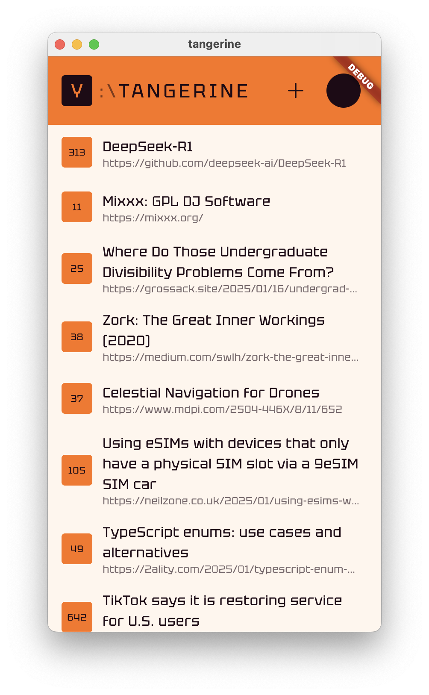

# Tangerine

## Описание

Это приложение для чтения новостей с фокусом на HackerNews. Цель этого проекта - предоставить минималистичный интерфейс для удобного просмотра статей, включая поддержку темной темы и возможность легкой работы в офлайн-режиме.

## Установка

Описаны инструкции по установке и запуску проекта:

1. Клонируйте репозиторий:
   ```bash
   git clone https://github.com/amka/tangerine.git

2. Перейдите в директорию проекта:
   ```bash
   cd tangerine
   ```
3. Запустите приложение:
   ```bash
   flutter run
   ```



## Контрибуции

Пожалуйста, отправляйте пул-реквесты для внесения изменений.

## Лицензия

Проект доступен под лицензией MIT.